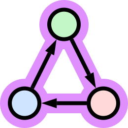

<div align="center">



# `vf2`

### VF2 subgraph isomorphism algorithm in Rust

[](https://crates.io/crates/vf2)
[](https://docs.rs/vf2/latest/vf2)
[](https://github.com/OwenTrokeBillard/vf2/actions)

<br/>
</div>

This crate implements the VF2 subgraph isomorphism algorithm [1].
It can find
[graph isomorphisms](https://en.wikipedia.org/wiki/Graph_isomorphism),
[subgraph isomorphisms](https://en.wikipedia.org/wiki/Subgraph_isomorphism_problem),
and [induced subgraph isomorphisms](https://en.wikipedia.org/wiki/Induced_subgraph_isomorphism_problem).
Graphs can be directed or undirected.

# Features

- [x] Enumerate graph isomorphisms
- [x] Enumerate subgraph isomorphisms
- [x] Enumerate induced subgraph isomorphisms
- [x] Support directed graphs
- [x] Support undirected graphs
- [x] Support disconnected graphs
- [x] Support node labels
- [x] Support edge labels
- [x] Graph trait

# Motivation

Subgraph matching is the task of finding instances of a query graph within a larger data graph. It is useful when
searching for patterns in a graph structure, such as searching a graph database. It is a fundamental
problem in graph theory with applications in pattern recognition, databases, security, and biochemistry.

An illustrative example is finding relationships in social networks. Consider a network like LinkedIn where each node is
a person, and each edge represents a connection. You are tasked with finding cases where five software developers and a
doctor all know each other. You can make a query graph with developers and a doctor, and search for instances of that
query in the larger network.

# What is a subgraph isomorphism?

A graph is a structure consisting of a set of objects where some pairs of objects are connected. A graph isomorphism is
a one-to-one correspondence between two graphs such that objects connected in one are also connected in the other.

### Graph isomorphism

For two graphs to be isomorphic, there must be a one-to-one correspondence between nodes such that neighbors in one are
also neighbors in the other. The query and data graphs in the following image are isomorphic.


### Subgraph isomorphism

It is often desirable to find instances of one graph within another. To do this, we search for subgraph isomorphisms. A
subgraph isomorphism is when one graph is isomorphic to a subgraph of another. There are two subgraph isomorphisms in
the following image.


### Induced subgraph isomorphism

An induced subgraph isomorphism is the same as a subgraph isomorphism except that the subgraph must be induced. Edges in
the data subgraph must also exist in the query graph.


# Usage

Add `vf2` to your dependencies in **Cargo.toml**.

```toml
[dependencies]
vf2 = "1.0"
```

Create your query and data graphs with [petgraph](https://github.com/petgraph/petgraph)
or any library that implements the `Graph` trait. Then, call one of the following
functions based on the problem type.

| Problem type                  | Call                                 |
|-------------------------------|--------------------------------------|
| Graph isomorphisms            | `vf2::isomorphisms`                  |
| Subgraph isomorphisms         | `vf2::subgraph_isomorphisms`         |
| Induced subgraph isomorphisms | `vf2::induced_subgraph_isomorphisms` |

These return a `Vf2Builder` with the algorithm configured.
Next, call one of the following on the builder to enumerate the isomorphisms.

| Desired output           | Call    |
|--------------------------|---------|
| First isomorphism        | `first` |
| Vector of isomorphisms   | `vec`   |
| Iterator of isomorphisms | `iter`  |

Filling a vector can consume a significant amount of memory.
Use the iterator to inspect isomorphisms as they are found.
For the best performance, call `next_ref`
on the iterator
instead of `next`
to avoid cloning each isomorphism.

You can configure the node and edge equality functions on the builder
with `node_eq` and `edge_eq`,
respectively.

# Example

This example shows how to find subgraph isomorphisms.

```rust
use petgraph::data::{Element, FromElements};
use petgraph::graph::DiGraph;

fn main() {
    // Create query graph.
    let query = DiGraph::<i32, ()>::from_elements([
        Element::Node { weight: 0 },
        Element::Node { weight: 1 },
        Element::Edge { source: 0, target: 1, weight: () },
    ]);

    // Create data graph.
    let data = DiGraph::<i32, ()>::from_elements([
        Element::Node { weight: 0 },
        Element::Node { weight: 1 },
        Element::Node { weight: 2 },
        Element::Edge { source: 0, target: 1, weight: () },
        Element::Edge { source: 1, target: 2, weight: () },
    ]);

    // Find subgraph isomorphisms.
    let isomorphisms = vf2::subgraph_isomorphisms(&query, &data).vec();
    assert_eq!(isomorphisms, vec![vec![0, 1], vec![1, 2]]);
}
```

# Remaining work

The crate is feature complete. The following will improve performance.

- [ ] Implement VF2 cutting rules
- [ ] Implement VF2++ (only VF2 implemented so far)

# References

[1] L. P. Cordella, P. Foggia, C. Sansone, and M. Vento,
“A (sub)graph isomorphism algorithm for matching large graphs,”
IEEE Transactions on Pattern Analysis and Machine Intelligence, vol. 26, no. 10, pp. 1367–1372,
Oct. 2004, doi: https://doi.org/10.1109/tpami.2004.75.

[2] A. Jüttner and P. Madarasi,
“VF2++—An improved subgraph isomorphism algorithm,”
Discrete Applied Mathematics, vol. 242, pp. 69–81,
Jun. 2018, doi: https://doi.org/10.1016/j.dam.2018.02.018.
